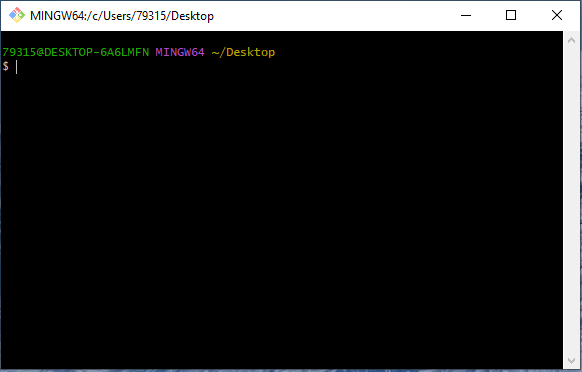
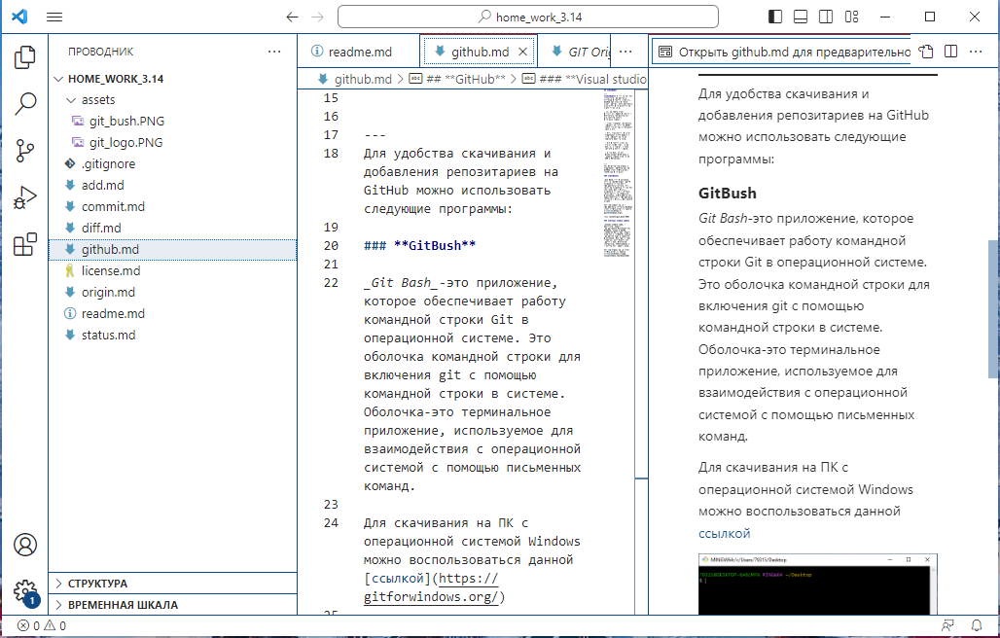

[<< вернутся к содержанию](./readme.md)

## **GitHub**
___
>##### Мы делали проект для друзей и коллег и не собирались делать площадку для всех программистов мира: мы просто хотели создать место, где можно будет легко делиться программным кодом.  -  Глава GitHub Крис Ванстрас
---
***GitHub*** — это сервис для совместной разработки и хостинга проектов. C помощью GitHub над кодом проекта может работать неограниченное количество программистов из любых точек мира.

Прямо на сайте можно просмотреть файлы проектов с подсветкой синтаксиса для большинства языков программирования.

 - Можно создавать приватные репозитории, которые будут видны только вам и выбранным вами людям. 

 - Есть возможность прямого добавления новых файлов в свой репозиторий через веб-интерфейс сервиса.

 - Код проектов можно не только скопировать через Git, но и скачать в виде обычных архивов с сайта.

 - Кроме Git, сервис поддерживает получение и редактирование кода через SVN и Mercurial.

---
    Для удобства скачивания и добавления репозитариев на GitHub можно использовать следующие программы:
 
### **GitBush** 

 _Git Bash_-это приложение, которое обеспечивает работу командной строки Git в операционной системе. Это оболочка командной строки для включения git с помощью командной строки в системе. Оболочка-это терминальное приложение, используемое для взаимодействия с операционной системой с помощью письменных команд.

Для скачивания на ПК с операционной системой Windows можно воспользоваться данной [ссылкой](https://gitforwindows.org/)

### **Visual studio code**

_Visual studio code_ - Текстовый редактор, разработанный Microsoft для Windows, Linux и macOS. Позиционируется как редактор кода для кроссплатформенной разработки веб- и облачных приложений. Включает в себя отладчик, инструменты для работы с Git, подсветку синтаксиса, IntelliSense и средства для рефакторинга. 

Для скачивания на ПК можно воспользоваться данной [ссылкой](https://code.visualstudio.com/download)

***

Для дальнейшей работы с _Git_ рассмотрим несколько основных комманд.

